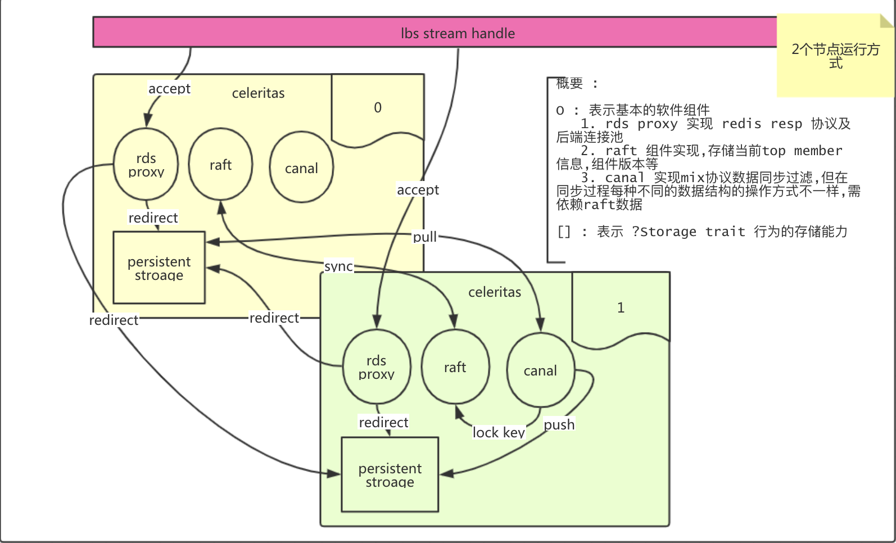
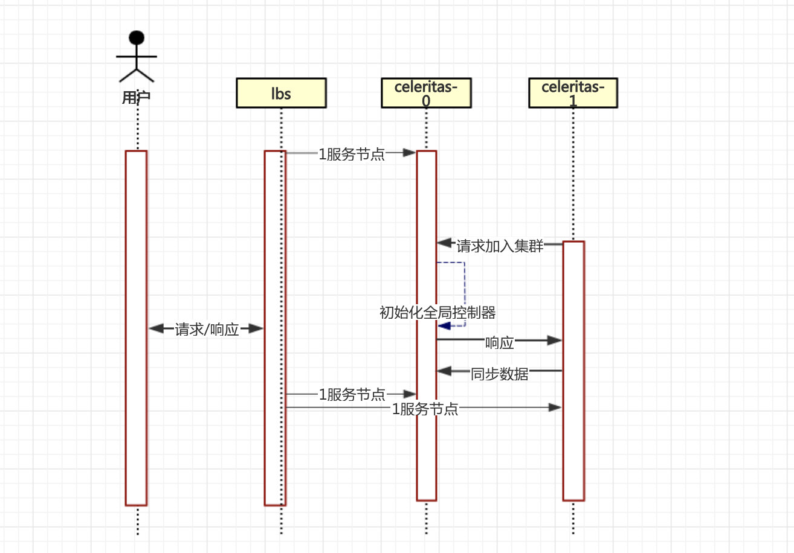

# celeritas 设计/需求说明

问题/痛点
--
在与DBA部门交流后,发现常用的架构有 redis cluster,sentinel,master slave 这几种方式,或者说有些只是单实例; 从当前使用的一些架构,都需要依赖 master slave 的方式来支撑实现,因大量业务在强依赖redis持久数据的设计,在数据实例出现宕机或者 unavailable 时在切换实例角色的话也是需要60秒内的操作(自动或者手动); 经此结论, DBA 部门对 redis 的管理方式的一个方式就是允许数据掉1秒内及在切换实例角色也在考虑切换抖动,防止脑裂的安全操作;

因为 redis 的原生方案的使用纯内存的架构,在使用的过程中,业务太依赖redis作为持久数据存储; 且业务方的数据量庞大及并发量高的问题; 当在kubernetes 的架构中的一个思考,能否实现redis集群的 oprator 及能够有效地减轻业务cache/persist storage占用大量内存资源的问题;

解决方案
--
在 kubernetes 的背景下,基于 nuwav1.statefulset 可以实现操作一个 redis statefulset + dyn pv在实例 unavailable 的时候,可以快速将 statefulset pod 飘移到可服务的节点上,可以实现 pod 及数据盘的的唯一性; 往上,可以看出在单实例可以替代原本的 master slave 架构; 

在解决MS架构的可用性上,为了拓/缩容及提高性能的问题; 基于AUPE设计指导计算存储分离的灵活方式,当前需开发一套新的组件程序实现 advanced cache storage 的全新 kubernetes RDS 数据库;

架构设计图
--

逻辑原理
--
整个实现中包含至少4个组件 proxy,canal,raft,storage;
  * proxy 实现redis resp[2,3]/memcache protocol等协议规范;
  * canal 实现将 redis 数据DTS 抽取回放;
  * raft 实现共享存储协议,在整个运行时架构中的成员列表,算法参数的共享;
  * storage 实现 redis/memcache 的原生存储; 
 

 扩容逻辑
--
1. celeritas 提供扩容接口,启动一个新的数据库(B),加入当前已存在的数据库(A); 
2. 在请求加入A时,若 A条件允许扩容时初始化 Raft<Mutex<kv>>并同时集群member数+1,标识正在拓容状态,响应B;
3. 若B被允许加入,则调用 canal 模块抽取属于 B 数据,同时马上对外服务;
4. 路由服务根据集群全局状态与数据分布算法决定请求重定向到相应的节点服务;

